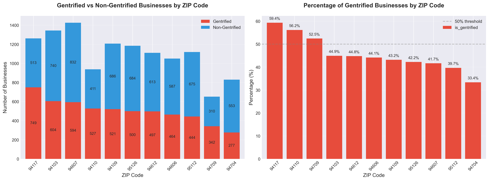

# Gentrification Classifier - EDA Summary
Sahith Karra

I set out to build a supervised gentrification classifier based on Yelp business data. The idea behind this project was to analyze businesses in the Bay Area (using select zip codes) and create labels for gentrified neighborhoods. Since "gentrification" is not a label provided by the Yelp API, we assign these labels based on a number of factors, including the density of certain types of businesses (such as matcha bars, yoga studios, etc.), the average price rating of the businesses, and conformity to trending categories.

## Dataset Stats 
The dataset combines Yelp API pulls for eleven Bay Area ZIP codes covering San Francisco (Mission, Castro, SOMA, North Beach), Oakland (West, Downtown, East), Berkeley (South, North), and San Jose (Downtown, Rose Garden). For each business I captured:
- Core Yelp metadata: name, rating, review count, price tier, coordinates, category list, primary category
- Trendy category tags: matcha, bubble tea, cafes, new American, vegan, poke, cocktail bars, desserts, pilates (explicitly requested in the API)
- Downstream labels: gentrification score, binary gentrified flag, indicator list, and ZIP-level aggregates

After deduplicating and cleaning, the final dataset includes 12,123 business records. Overall, 45.5% (5,519) meet the gentrification criteria.

## Labelling Approach
1. Price Tier - businesses priced in `$$$` and `$$$$` were weighted more heavily
2. Categories and signals - outlined above
3. Ratings - high ratings and reviews

## Exploratory Highlghts
- Zip level differences

Mission (94110), Castro (94117), and Downtown Oakland (94612) top the list with gentrified business shares above 55% confirming expectations. San Jose zip codes showed lower proportions reflecting slower retail scaling

- Price tiers

- Among gentrified businesses, tier 3 domiantes 
- Non gentrified buisiesses cluster in the tier 1-2 range
